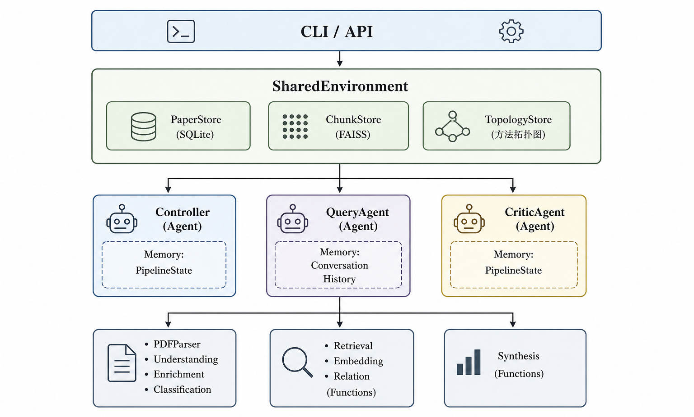

# ScholarGraph

本地优先的 AI 论文研究与分析方法系统，基于 Agent + RAG 架构，支持多论文理解、关系挖掘、知识拓扑构建。


> **图 1**: LoRA 相关方法的演进关系拓扑图。节点表示方法，边表示方法间的改进关系及改进方向。

## 特性

- **多 Agent 协作**: Contoller、QueryAgent、CriticAgent 分工明确
- **混合 RAG**: 向量检索 + 结构化检索
- **方法拓扑图**: 追踪方法演进关系
- **CCF 评级映射**: 自动识别论文学术级别
- **LLM 驱动**: 支持 MiniMax、OpenAI、Anthropic 等

## 架构



## 安装

### 1. 进入项目目录

```bash
cd ScholarGraph
```

### 2. 安装依赖

```bash
# 使用 conda 环境
conda activate agent

# 安装项目
pip install -e .
```

### 3. 下载模型

系统需要两个模型，均从 `config/config.yaml` 读取：

```bash
# 下载 Embedding 模型 + Reranker 模型到 ./models 目录
python -m ScholarGraph.cli download-model

# 指定本地模型保存路径
python -m ScholarGraph.cli download-model --output-dir ./models
```

下载后修改 `config/config.yaml` 使用本地路径：

```yaml
embedding:
  provider: "transformers"
  model: "./models/microsoft_harrier-oss-v1-0.6b"
  dimension: 1024
  pooling_strategy: "last_token"
```
  device: "cpu"
```

### 4. 安装 Graphviz（用于生成拓扑图）

Graphviz 用于生成方法拓扑图。

1. **安装 Python 包**：

```bash
pip install graphviz
```

2. **安装 Graphviz 软件**：
   - macOS: `brew install graphviz`
   - Linux: `sudo apt install graphviz` 或 `sudo yum install graphviz`
   - Windows: 从 https://graphviz.org/download/ 下载安装

安装后将 Graphviz 的 bin 目录添加到系统 PATH 环境变量。

### 5. 配置

编辑 `config/config.yaml`：

```yaml
# LLM 配置（必需）
llm:
  provider: "anthropic"  # 或 "openai"
  model: "MiniMax-M2.7-highspeed"
  api_key: "your_api_key_here"
  base_url: "https://api.minimaxi.com/anthropic"
  timeout: 60

# Embedding 配置
embedding:
  provider: "transformers"
  model: "./models/sentence-transformers_all-MiniLM-L6-v2"  # 本地路径，或 HuggingFace 模型名
  dimension: 384
  device: "cpu"

# PDF 解析配置
pdf_parser:
  primary: "pdfplumber"  # 或 "grobid"
```

## 使用

### 分类体系

系统使用 field → subfield 层级分类体系，支持以下来源：

| 来源    | 说明                                 | 来源链接                                                         |
| ------- | ------------------------------------ | ---------------------------------------------------------------- |
| ccs     | ACM Computing Classification System  | https://www.acm.org/publications/computing-classification-system |
| ccf     | 中国计算机学会推荐学术会议与期刊列表 | https://ccf-cccr.ccf.org.cn/                                     |
| journal | SCI 期刊分类                         | https://journals.clarivate.com/                                  |
| custom  | 自定义 YAML 文件                     | 用户自行编写                                                     |

也可以自行编写 YAML 文件格式的分类体系：

```yaml
fields:
  - name: "领域名称"
    subfields:
      - "子领域1"
      - "子领域2"
```

### CLI 命令

```bash
# 初始化项目（创建数据目录和默认分类体系）
python -m ScholarGraph.cli init

# 下载 embedding 模型到本地（推荐，避免每次运行时下载）
python -m ScholarGraph.cli download-model

# 解析单篇论文
python -m ScholarGraph.cli parse paper.pdf

# 批量解析论文
python -m ScholarGraph.cli ingest ./papers/

# 查询论文
python -m ScholarGraph.cli query "LoRA 方法的改进有哪些？"

# 更新分类体系（从 ACM CCS 来源获取，会自动重新分类已有论文）
python -m ScholarGraph.cli update-taxonomy ccs

# 更新分类体系（从 CCF 来源获取）
python -m ScholarGraph.cli update-taxonomy ccf

# 更新分类体系（使用自定义 YAML 文件）
python -m ScholarGraph.cli update-taxonomy custom --file ./my_taxonomy.yaml

# 更新分类体系（不重新分类已有论文）
python -m ScholarGraph.cli update-taxonomy ccs --no-reclassify

# 更新 CCF 评级映射
python -m ScholarGraph.cli update-ccf ./CCF目录.pdf

# 启动交互模式
python -m ScholarGraph.cli repl
```

### 拓扑图生成

方法拓扑图用于可视化论文方法之间的改进关系。

**命令行生成：**

```bash
# 生成拓扑图（PNG 格式）
python -m ScholarGraph.cli topology

# 指定输出路径
python -m ScholarGraph.cli topology --output-path ./output/my_topology.png

# 导出 JSON 格式（包含节点和边的详细数据）
python -m ScholarGraph.cli topology --format json --output-path ./output/topology.json
```

**REPL 中生成：**

在交互模式下，输入包含以下关键词时会自动生成拓扑图：

- 拓扑图、关系图、方法图
- topology、graph
- 关系网络、方法关系

```
ScholarGraph> 生成 LoRA 相关方法的拓扑图
[INFO] 正在生成拓扑图...
[INFO] 拓扑图已保存到: ./output/topology.png
[INFO] 拓扑数据已保存到: ./output/topology.json
```

**Python API 生成：**

```python
from ScholarGraph import SharedEnvironment
from ScholarGraph.utils.topology_visualizer import generate_topology_graph, export_topology_json

env = SharedEnvironment(
    db_path="./data/ScholarGraph.db",
    vector_index_path="./data/chunks.faiss",
    embedding_dimension=384
)

# 生成 PNG 图
generate_topology_graph(env, "./output/topology.png")

# 导出 JSON 数据
export_topology_json(env, "./output/topology.json")
```

生成的拓扑图中：

- **红色节点**：根方法（无父方法）
- **青色节点**：第一层改进
- **蓝色节点**：第二层改进
- **绿色节点**：更深层改进
- **边**：方法间的改进关系

### Python API

```python
from ScholarGraph import SharedEnvironment
from ScholarGraph.agents import Controller, QueryAgent, CriticAgent
from ScholarGraph.memory import ConversationHistory, PipelineState
from ScholarGraph.models import Paper
from ScholarGraph.llm import LLMClient, Message

# 1. 初始化环境
env = SharedEnvironment(
    db_path="./data/ScholarGraph.db",
    vector_index_path="./data/chunks.faiss",
    embedding_dimension=384
)

# 2. 初始化 Agent
controller = Controller(env)
query_agent = QueryAgent(ConversationHistory(session_id="user1"))
critic_agent = CriticAgent(PipelineState())

# 3. 执行论文摄取
result = controller.run_ingestion(
    pdf_path="./papers/lora.pdf",
    metadata={"source": "arxiv"}
)
print(f"Ingestion result: {result}")

# 4. 执行查询
query_result = query_agent.execute(
    env=env,
    query="LoRA 和 Adapter 有什么区别？"
)
print(f"Query analysis: {query_result.data}")

# 5. 获取答案并评估
# ... (Retrieval -> Synthesis -> Critic)
```

### 完整查询流程

```python
from ScholarGraph.functions import Retrieval, Synthesis
from ScholarGraph.models import QueryAnalysisResult

# 1. 查询分析
query_analysis = query_agent.execute(env, "比较 LoRA 和 AdaLoRA")

# 2. 检索相关论文
retrieval_func = Retrieval()
papers = retrieval_func.execute(env, query_analysis.data)

# 3. 合成答案
synthesis_func = Synthesis()
answer = synthesis_func.execute(env, papers, query_analysis.data)

# 4. 评估答案
critique = critic_agent.execute(env, answer, query_analysis.data["original_query"])

# 5. 如需重试
if not critique.data["passed"]:
    print(f"Failed checks: {critique.data['failed_checks']}")
    # 重新检索或修改查询
```

## 项目结构

```
ScholarGraph/
├── src/ScholarGraph/
├── tests/
├── config/
├── data/                # SQLite 数据库、FAISS 索引
├── output/              # 生成的拓扑图
├── models/              # 下载的 embedding 模型
├── README.md
├── pyproject.toml
└── requirements.txt
```

## 测试

```bash
# 运行所有测试
pytest tests/ -v

# 运行特定测试
pytest tests/test_agents.py -v

# 带覆盖率
pytest tests/ --cov=src/ScholarGraph --cov-report=html
```

## 常见问题

### Q: FAISS 未安装？

```
WARNING: FAISS not available, using numpy fallback
```

安装 faiss-cpu：`pip install faiss-cpu`

### Q: LLM API 调用失败？

1. 检查 `api_key` 是否正确
2. 检查 `base_url` 是否匹配（Anthropic vs OpenAI 格式）
3. 确认网络连接

### Q: PDF 解析失败？

- 使用 pdfplumber：`pip install pdfplumber`
- 或使用 Grobid 服务：`pip install lxml` 并启动 Grobid 服务

### Q: 如何添加新的论文领域？

1. 编辑 `config/taxonomy.yaml` 添加新的 field/subfield 分类
2. 使用 CLI 更新分类体系并重新分类已有论文：

```bash
python -m ScholarGraph.cli update-taxonomy ./config/taxonomy.yaml
```

### Q: 分类体系文件不存在？

运行 `python -m ScholarGraph.cli init` 初始化项目，会自动创建默认分类体系。

### Q: TaxonomyNotFoundError 异常？

分类体系文件缺失或无效。解决方案：

1. 运行 `python -m ScholarGraph.cli init` 创建默认分类体系
2. 或使用 `update-taxonomy` 命令更新分类体系

### Q: Graphviz 生成失败？

1. 确认已安装 Graphviz 软件：从 https://graphviz.org/download/ 下载
2. 确认已将 Graphviz bin 目录添加到 PATH 环境变量
3. 运行 `dot -V` 验证安装
4. 如果无法使用 Graphviz，系统会自动回退到 matplotlib 生成图
